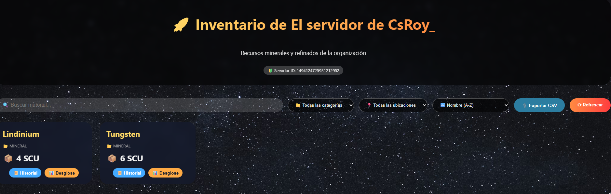
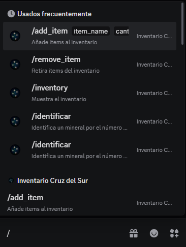
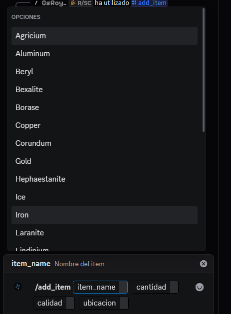
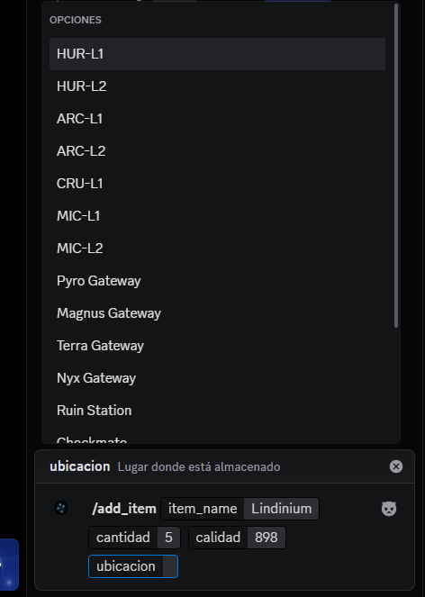
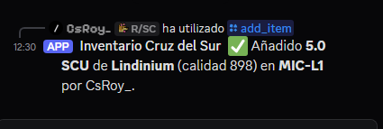
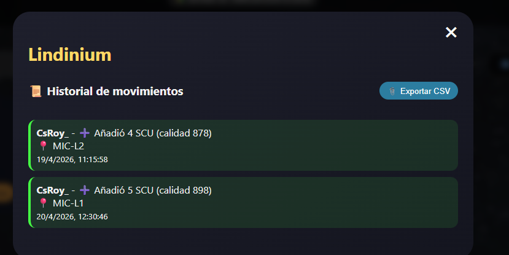
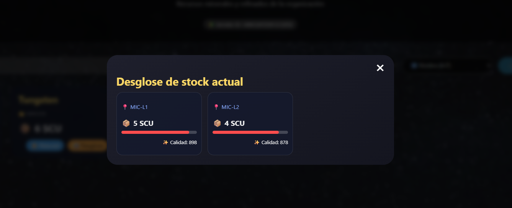

# 📦 SC Inventory - Cruz del Sur

Sistema de inventario multi-servidor para organizaciones de Star Citizen.  
Permite gestionar recursos (minerales, refinados, componentes, gases) con calidad y ubicación, historial completo, gráficas de evolución, desglose por calidad/ubicación y panel de administración.

## 🚀 Características

- Inventario independiente por servidor de Discord (cada guild tiene el suyo)
- Comandos slash en Discord: /add_item, /remove_item, /inventory, /orgweb, /identificar, /estimar, /tabla
- Autocompletado de materiales, ubicaciones y minerales
- Web con diseño oscuro estilo Star Citizen
- Gráficas de evolución de stock por material
- Desglose detallado por calidad y ubicación (con barras de calidad)
- Exportación a CSV del inventario y del historial
- Panel de administración con login
- Base de datos MongoDB persistente
- Desplegable con Docker Compose + Cloudflare Tunnel (opcional)

## 🛠️ Tecnologías

- Backend: FastAPI + Motor (MongoDB async) + Pydantic
- Frontend: React + Vite + Chart.js
- Bot de Discord: discord.py + httpx
- Proxy: Nginx
- Base de datos: MongoDB 6
- Orquestación: Docker Compose
- Infraestructura: Cloudflare Tunnel (HTTPS)

## 📦 Instalación y despliegue

### Requisitos previos
- Servidor con Docker y Docker Compose instalados
- Puerto 5174 (web) y 8002 (API) accesibles (o usar túnel Cloudflare)
- Un bot de Discord creado en Discord Developer Portal con token y permisos

### Pasos

1. Clona el repositorio
   git clone https://github.com/raspiardui/sc-inventory-discord-bot.git
   cd sc-inventory-discord-bot

2. Configura el token de Discord
   cp .env.example .env
   nano .env   (Introduce tu token de Discord)

3. Inicia los servicios
   docker compose up -d

4. Accede a la web
   http://IP_DEL_SERVIDOR:5174/?guild=ID_DEL_SERVIDOR
   (El ID del servidor lo obtienes en Discord con el modo desarrollador)

5. Invita al bot a tu servidor
   Usa el enlace de invitación generado en el Developer Portal con los scopes bot y applications.commands

## 🔧 Configuración adicional

- Credenciales de administrador (por defecto admin / admin123). Se pueden cambiar en docker-compose.yml (variables ADMIN_USERNAME y ADMIN_PASSWORD)
- Ubicaciones y minerales disponibles se editan en backend/main.py (listas LOCATIONS y MINERAL_DATA)
- Fondo de la web: modifica la URL en frontend/src/App.jsx (estilo container.backgroundImage)

## 📷 Capturas de pantalla

### Web principal

### Comandos de Discord

### Autocompletado de materiales

### Selección de ubicación

### Confirmación en Discord

### Historial de movimientos

### Desglose por calidad y ubicación

## 🤝 Contribuciones

Las contribuciones son bienvenidas. Por favor, abre un issue o pull request en GitHub.

## 📄 Licencia

MIT

## 🙏 Agradecimientos

- Inspirado en las mecánicas de minería y crafteo de Star Citizen.
- Tablas de firmas de minerales basadas en datos de la comunidad.

---
Desarrollado con ❤️ para la comunidad de Star Citizen.
